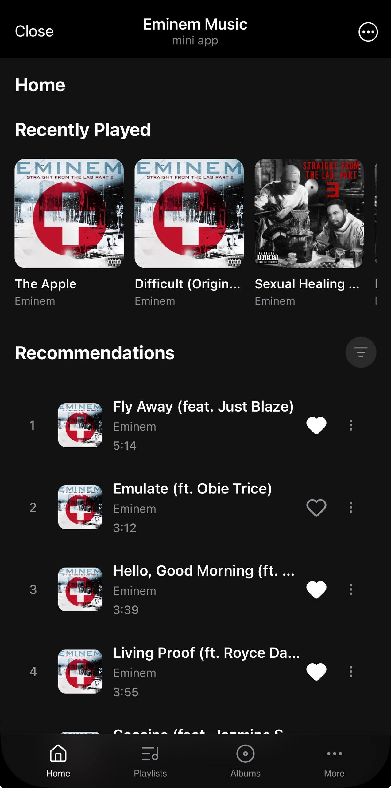
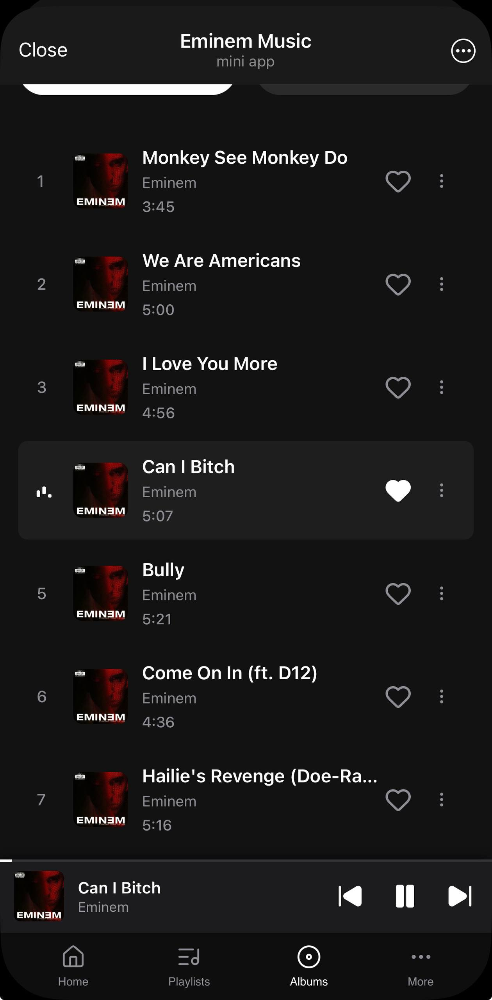
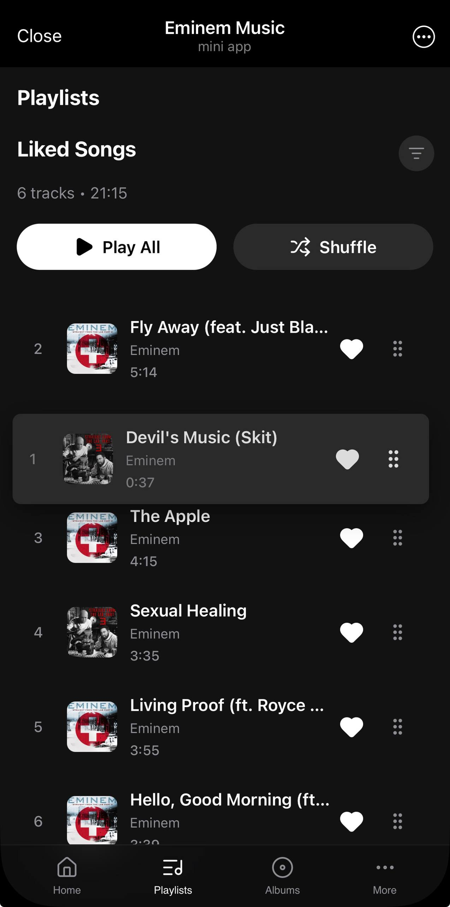

# Eminem Player (Telegram Mini App)

Музыкальный плеер в формате Telegram Mini App для каталогизации и стриминга дискографии и неизданных треков артиста, ориентированный на мобильных пользователей Telegram.

---

## Интерфейс

| Home | Album detail | Full player | Playlist |
| :---: | :---: | :---: | :---: |
|  |  |  |  |

*(Дополнительные экраны: [Каталог альбомов](screenshots/AlbumsPage.jpg) · [Профиль и настройки](screenshots/MorePage.jpg))*

---

## Функционал

- **Авторизация через Telegram `initData`**: криптографическая проверка подлинности сессии (HMAC-SHA256) на бэкенде с последующей выдачей JWT-токена.
- **Потоковое воспроизведение с очередью**: непрерывный аудиодвижок на базе HTML5 Audio (синглтон вне жизненного цикла React), поддержка очередей, автоперехода к следующему треку и перемешивания.
- **Рекомендации на основе истории**: локальный и серверный учет прослушиваний с формированием персональной подборки треков.
- **Избранное с оптимистичным UI**: мгновенное обновление интерфейса при добавлении/удалении треков с автоматическим откатом стейта при ошибке сети.
- **Drag-and-Drop сортировка плейлиста**: кастомное упорядочивание треков в избранном с помощью `@dnd-kit` и синхронизацией порядка с базой данных.
- **Интеграция с Telegram-ботом**: бот-компаньон на Aiogram для каталожного поиска треков и отправки аудиофайлов напрямую в диалог.

---

## Стек технологий

### Frontend
- **React 19.2** / **TypeScript**
- **Redux Toolkit 2.12** / **React-Redux 9.3**
- **Vite 8.0**
- **@tma.js/sdk-react 3.0** (Telegram Mini Apps SDK)
- **@dnd-kit/sortable 10.0** / **@dnd-kit/react 0.5**
- **Lucide React 1.33**

### Backend
- **Python 3.11+** / **FastAPI 0.138**
- **PostgreSQL** / **SQLAlchemy 2.0.51** (asyncpg 0.31)
- **Aiogram 3.29** (Telegram Bot API)
- **Alembic 1.18** (миграции БД)
- **Supabase Storage** / **S3** (хранение аудио и обложек)
- **Mutagen 1.48** (парсинг аудио-метаданных и ID3-тегов)

---

## Архитектура

Фронтенд спроектирован по методологии **Feature-Sliced Design (FSD)**, что обеспечивает строгую иерархию слоев (`app` → `pages` → `widgets` → `features` → `entities` → `shared`) и защищает кодовую базу от циклических зависимостей. Аудиопоток изолирован в независимом синглтоне `audioEngine`, который синхронизируется с Redux-хранилищем через реактивные события. На бэкенде используется асинхронная слоистая архитектура с разделением сетевых роутеров, сервисов валидации безопасности и ORM-репозиториев.

Подробности реализации каждого слоя описаны в соответствующей документации:
- 📖 [Документация Frontend](frontend/README.md) — структура FSD, Redux-слайсы, хуки синхронизации плеера и UI-компоненты.
- 📖 [Документация Backend](backend/README.MD) — спецификация REST API, схема моделей PostgreSQL, безопасность и фоновые процессы бота.

---

## Демо

- Telegram Bot / Mini App: [@eminem_player_bot](https://t.me/eminem_player_bot)
