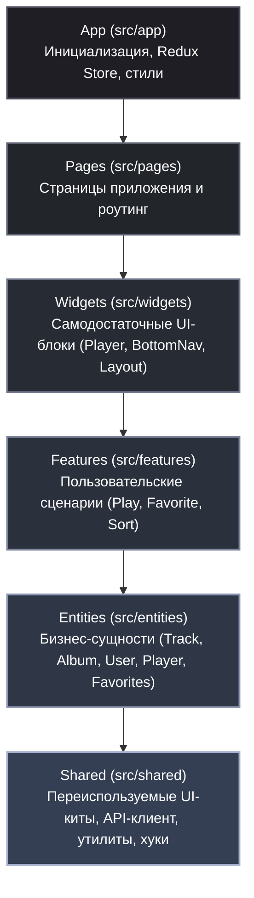

# Telegram Mini App Player — Frontend Documentation

> **Клиентская часть веб-приложения / Telegram Mini App (TMA) для стриминга музыки**.  
> Стек: **React 19**, **TypeScript**, **Vite 8**, **Redux Toolkit**, **@dnd-kit**, **Lucide Icons**, **TMA SDK**.  
> Архитектурная методология: **Feature-Sliced Design (FSD)**.

---

## 🏛 1. Архитектурное решение

Кодовая база клиентской части организована в соответствии с методологией **Feature-Sliced Design (FSD)**. Данный подход выбран для масштабируемости, строгой изоляции зон ответственности и исключения циклических зависимостей в приложении с сложным состоянием (аудиостриминг, очередь воспроизведения, drag-and-drop сортировка избранного, синхронизация с Telegram WebApp).



### Применяемые паттерны и архитектурные принципы

1. **Feature-Sliced Design (Strict Downward Dependencies)**:
   - Каждый слой зависит только от слоев, расположенных строго ниже по иерархии.
   - Слайсы инкапсулируют логику внутри папок `model/`, `ui/`, `api/`, `lib/` и предоставляют контролируемый доступ во внешний мир через `index.ts` (Public API).
2. **Audio Engine Singleton & Facade Pattern**:
   - Воспроизведение звука инкапсулировано в объекте [[audioEngine]](./src/entities/player/lib/audioEngine.ts#L4-L19), управляющем экземпляром HTML5 `Audio`. Это изолирует жизненный цикл звука от ре-рендеров и размонтирования React-дерева.
3. **Event-Driven Reactive Loop**:
   - Связь между нативным HTML5 `Audio` и Redux Store реализована через подписку на события аудио-ноды в хуке [[usePlayerSync]](./src/shared/hooks/usePlayerSync.ts#L8-L34), который диспатчит действия обновления прогресса, длительности и статуса.
4. **Optimistic UI Updates with Rollback**:
   - При переключении лайков ([[toggleFavorite]](./src/features/toggle-favorite/model/toggleFavorite.ts#L10-L43)) и сортировке избранного через Drag-and-Drop Redux-стейт обновляется мгновенно. В случае сбоя сети выполняется автоматический откат состояния до исходного.
5. **Decoupled Interceptor EventBus**:
   - При получении `401 Unauthorized` в Axios-перехватчике [[api.ts]](./src/shared/api/api.ts#L23-L34) вызывается событие `window.dispatchEvent(new Event("auth:expired"))`. Слой `app` слушает это событие, предотвращая запрещенную зависимость `shared -> app/store`.
6. **Compound Components & Layout Slotting**:
   - Оболочка страниц [[Page]](./src/shared/ui/page/Page.tsx#L8-L10) и [[PageHeader]](./src/shared/ui/page/Page.tsx#L19-L39) стандартизируют мобильные отступы и навигационную шапку во всех маршрутах.

---

## 📁 2. Разбор каждого файла

```
frontend/
├── Configuration & Meta
│   ├── eslint.config.js
│   ├── index.html
│   ├── package.json
│   ├── package-lock.json
│   ├── tsconfig.json
│   ├── tsconfig.app.json
│   ├── tsconfig.node.json
│   ├── vite.config.ts
│   ├── README.md
├── public/
│   └── em.png
└── src/
    ├── main.tsx
    ├── vite-env.d.ts
    ├── app/
    │   ├── app.tsx
    │   ├── store/index.ts
    │   └── styles/variables.css
    ├── pages/
    │   ├── routes.tsx
    │   ├── home/ (page.tsx, page.css)
    │   ├── album/ (page.tsx, page.css)
    │   ├── albums/ (page.tsx, page.css)
    │   ├── playlist/ (page.tsx, page.css)
    │   └── more/ (page.tsx, page.css)
    ├── widgets/
    │   ├── Layout/ (Layout.tsx, Layout.css)
    │   ├── bottom-nav/ (BottomNav.tsx, BottomNav.css)
    │   └── player/ (index.ts, PlayerWidget.tsx, MiniPlayer/, FullPlayer/)
    ├── features/
    │   ├── play-track/ (index.ts, playerNavigation.ts)
    │   ├── play-collection/ (index.ts, PlayActionButtons.tsx, .module.css)
    │   ├── toggle-favorite/ (index.ts, toggleFavorite.ts, FavoriteBtn/, MoreVertacalBtn/)
    │   └── sort-collection/ (index.ts, slice.ts, selectors.ts, types.ts, config.tsx, hooks, ui/)
    ├── entities/
    │   ├── album/ (index.ts, albumApi.ts, slice.ts, selectors.ts, types.ts, AlbumCard, Skeleton)
    │   ├── favorites/ (index.ts, favoritesApi.ts, slice.ts, selectors.ts, types.ts)
    │   ├── player/ (index.ts, audioEngine.ts, slice.ts, selectors.ts, types.ts)
    │   ├── track/ (index.ts, trackApi.ts, slice.ts, selectors.ts, types.ts, TrackCard, SortableTrackCard, Skeleton)
    │   └── user/ (index.ts, userApi.ts, slice.ts, selectors.ts)
    └── shared/
        ├── api/api.ts
        ├── config/constants.tsx
        ├── types/types.ts
        ├── hooks/ (useClickOutside, useFavoriteIds, useHomeData, usePlayerSync, useTelegram)
        ├── lib/ (handleAxiosError, fortmatDuration, getRecommendations, recentlyPlayed)
        └── ui/ (button/, page/, ProgressBar/, Skeleton/, Splash/)
```

---

### ⚙️ Конфигурация и окружение

#### [package.json](./package.json)
- **Задача**: Определение манифеста проекта, скриптов запуска/сборки/линта и зависимостей приложения.
- **Ключевые зависимости**: `@reduxjs/toolkit`, `react@19`, `react-dom@19`, `react-router-dom@7`, `axios`, `@tma.js/sdk-react`, `@dnd-kit/core`, `@dnd-kit/sortable`, `lucide-react`, `howler`.
- **Зависимости**: Не зависит от внутренних модулей.

#### [package-lock.json](./package-lock.json)
- **Задача**: Фиксация точных версий и графа установленных зависимостей npm.
- **Зависимости**: Сгенерирован менеджером npm.

#### [vite.config.ts](./vite.config.ts)
- **Задача**: Конфигурация бандлера Vite, настройка плагина React, путевого псевдонима (alias `@` -> `./src`) и dev-проксирования запросов `/api` на бэкенд `http://localhost:8000`.
- **Экспорт**: Конфигурация по умолчанию (`defineConfig`).
- **Зависимости**: `vite`, `@vitejs/plugin-react`, `node:path`.

#### [tsconfig.json](./tsconfig.json)
- **Задача**: Базовый мета-файл TypeScript с проектными ссылками (`project references`) на клиентский и серверный/нодовый конфиги компилятора.
- **Зависимости**: Ссылается на `tsconfig.app.json` и `tsconfig.node.json`.

#### [tsconfig.app.json](./tsconfig.app.json)
- **Задача**: Настройка компилятора TypeScript для клиентского кода: таргет `ES2022`, режим бандлера, строгий режим (`strict`), алиас `@/*` -> `./src/*` и типы `telegram-web-app`.
- **Зависимости**: Включает каталог `src`.

#### [tsconfig.node.json](./tsconfig.node.json)
- **Задача**: Конфигурация TypeScript для файлов сборщика (`vite.config.ts`).
- **Зависимости**: `vite/client`.

#### [eslint.config.js](./eslint.config.js)
- **Задача**: Flat-конфиг ESLint с правилами для React Hooks, Fast Refresh и поддержкой синтаксиса TypeScript/JSX.
- **Зависимости**: `@eslint/js`, `globals`, `eslint-plugin-react-hooks`, `eslint-plugin-react-refresh`.

#### [index.html](./index.html)
- **Задача**: Входной HTML-документ одностраничного приложения. Подключает официальный Telegram Web App SDK (`telegram-web-app.js`), настраивает viewport и монтирует контейнер `#root`.
- **Зависимости**: script [main.tsx](./src/main.tsx), favicon [em.png](./public/em.png).

#### [public/em.png](./public/em.png)
- **Задача**: Статическое изображение-логотип плеера, используемое в качестве иконки приложения и заглушек.

#### [src/vite-env.d.ts](./src/vite-env.d.ts)
- **Задача**: Подключение глобальных деклараций типов Vite (`vite/client`) и Telegram WebApp (`telegram-web-app`).

---

### 🚀 Слой инициализации (App Layer)

#### [src/main.tsx](./src/main.tsx)
- **Задача**: Главная точка входа приложения. Инициализирует Telegram Mini App SDK (`init()`, `WebApp.ready()`, `WebApp.expand()`), подключает корневой CSS со стилями и монтирует React-дерево в DOM c провайдерами `Provider (Redux)` и `BrowserRouter`.
- **Экспорт**: Нет (выполняет сайд-эффект монтирования).
- **Зависимости**: [variables.css](./src/app/styles/variables.css), [App](./src/app/app.tsx#L13-L72), [store](./src/app/store/index.ts#L9-L18), `@tma.js/sdk-react`, `react-dom/client`, `react-router-dom`, `react-redux`.

#### [src/app/app.tsx](./src/app/app.tsx)
- **Задача**: Корневой компонент жизненного цикла приложения. Запускает Telegram-аутентификацию ([[authByTelegram]](./src/entities/user/api/userApi.ts#L10-L24)), подписывается на событие устаревания токена `auth:expired`, загружает избранные треки пользователя при успешном логине, сохраняет текущий воспроизводимый трек в `recentlyPlayed` и рендерит [Splash](./src/shared/ui/Splash/Splash.tsx#L5-L13) на время загрузки.
- **Экспорт**: [App](./src/app/app.tsx#L13-L72).
- **Зависимости**: [Routing](./src/pages/routes.tsx#L9-L21), [authByTelegram](./src/entities/user/api/userApi.ts#L10-L24), [selectAuthStatus](./src/entities/user/model/selectors.ts#L4), [selectCurrentTrack](./src/entities/player/model/selectors.ts#L3-L4), [addToRecentlyPlayed](./src/shared/lib/storage/recentlyPlayed.ts#L6-L14), [fetchFavorites](./src/entities/favorites/api/favoritesApi.ts#L6-L16), [Splash](./src/shared/ui/Splash/Splash.tsx#L5-L13).

#### [src/app/store/index.ts](./src/app/store/index.ts)
- **Задача**: Конфигурация глобального хранилища Redux Toolkit, объединяющего редьюсеры всех сущностей и фич.
- **Экспорт**: [store](./src/app/store/index.ts#L9-L18), типы `RootState`, `AppDispatch`.
- **Зависимости**: [albumReducer](./src/entities/album/model/slice.ts#L46), [favoriteReducer](./src/entities/favorites/model/slice.ts#L58), [playerReducer](./src/entities/player/model/slice.ts#L38), [trackReducer](./src/entities/track/model/slice.ts#L65), [userReducer](./src/entities/user/model/slice.ts#L46), [sortReducer](./src/features/sort-collection/model/slice.ts#L22), `@reduxjs/toolkit`.

#### [src/app/styles/variables.css](./src/app/styles/variables.css)
- **Задача**: Глобальная дизайн-система приложения: определение CSS-переменных темы (темный UI, цвета поверхностей, типографика, радиусы, высота таббара и плеера `--safe-area-bottom`), сброс стилей и утилитарные классы (`.text-truncate`, `.icon-btn`).

---

### 🗺 Слой страниц (Pages Layer)

#### [src/pages/routes.tsx](./src/pages/routes.tsx)
- **Задача**: Центральный маршрутизатор приложения на базе `react-router-dom`. Оборачивает страницы в общий лейаут.
- **Экспорт**: [Routing](./src/pages/routes.tsx#L9-L21).
- **Зависимости**: [Layout](./src/widgets/Layout/ui/Layout.tsx#L8-L18), [HomePage](./src/pages/home/page.tsx#L13-L78), [PlaylistPage](./src/pages/playlist/page.tsx#L35-L126), [ALbumsPage](./src/pages/albums/page.tsx#L17-L59), [AlbumDetailPage](./src/pages/album/page.tsx#L24-L96), [MorePage](./src/pages/more/page.tsx#L8-L36).

#### [src/pages/home/page.tsx](./src/pages/home/page.tsx) & [page.css](./src/pages/home/page.css)
- **Задача**: Главная страница плеера. Отображает горизонтальную карусель недавно прослушанных треков (`Recently Played`) и умные рекомендации (`Recommendations`) с поддержкой сортировки и добавления в избранное.
- **Экспорт**: [HomePage](./src/pages/home/page.tsx#L13-L78).
- **Зависимости**: [useHomeData](./src/shared/hooks/useHomeData.ts#L13-L43), [TrackCard](./src/entities/track/ui/TrackCard.tsx#L19-L109), [TrackCardSkeleton](./src/entities/track/ui/TrackCardSkeleton.tsx), [playTrack](./src/features/play-track/model/playerNavigation.ts#L25-L29), [toggleFavorite](./src/features/toggle-favorite/model/toggleFavorite.ts#L10-L43), [useFavoriteIds](./src/shared/hooks/useFavoriteIds.ts#L5-L14), [SortCollectionBtn](./src/features/sort-collection/ui/SortCollectionBtn.tsx#L10-L65), [useSortedTracks](./src/features/sort-collection/model/useSortedTracks.ts#L5-L21), [Page](./src/shared/ui/page/Page.tsx#L8-L10).

#### [src/pages/albums/page.tsx](./src/pages/albums/page.tsx) & [page.css](./src/pages/albums/page.css)
- **Задача**: Страница дискографии. Загружает список альбомов артиста через Redux thunk, сортирует их и выводит сеткой с переходом на экран деталей альбома.
- **Экспорт**: [ALbumsPage](./src/pages/albums/page.tsx#L17-L59).
- **Зависимости**: [fetchAlbums](./src/entities/album/api/albumApi.ts#L6-L16), [selectAlbums](./src/entities/album/model/selectors.ts#L3), [AlbumCard](./src/entities/album/ui/AlbumCard.tsx#L9-L27), [AlbumCardSkeleton](./src/entities/album/ui/AlbumCardSkeleton.tsx), [SortCollectionBtn](./src/features/sort-collection/ui/SortCollectionBtn.tsx#L10-L65), [useSortedTracks](./src/features/sort-collection/model/useSortedTracks.ts#L5-L21).

#### [src/pages/album/page.tsx](./src/pages/album/page.tsx) & [page.css](./src/pages/album/page.css)
- **Задача**: Детальная страница выбранного альбома. Отображает обложку альбома, общее число треков, панель действий (Play All / Shuffle) и список композиций альбома.
- **Экспорт**: [AlbumDetailPage](./src/pages/album/page.tsx#L24-L96).
- **Зависимости**: [selectAlbumById](./src/entities/album/model/selectors.ts#L5-L6), [fetchAlbumTracks](./src/entities/track/api/trackApi.ts#L18-L28), [PlayActionButtons](./src/features/play-collection/ui/PlayActionButtons.tsx#L14-L51), [TrackCard](./src/entities/track/ui/TrackCard.tsx#L19-L109), `lucide-react`.

#### [src/pages/playlist/page.tsx](./src/pages/playlist/page.tsx) & [page.css](./src/pages/playlist/page.css)
- **Задача**: Страница избранного («Liked Songs»). Поддерживает переупорядочивание треков жестами drag-and-drop через `@dnd-kit`, синхронизацию нового порядка с сервером через thunk [[reorderFavorites]](./src/entities/favorites/api/favoritesApi.ts#L29-L41), сортировку и расчет общей длительности.
- **Экспорт**: [PlaylistPage](./src/pages/playlist/page.tsx#L35-L126).
- **Зависимости**: `@dnd-kit/core`, `@dnd-kit/sortable`, [SortableTrackCard](./src/entities/track/ui/SortableTrackCard.tsx#L14-L46), [selectFavorites](./src/entities/favorites/model/selectors.ts#L3), [reorderFavorites](./src/entities/favorites/api/favoritesApi.ts#L29-L41), [reorderFavoriteLocal](./src/entities/favorites/model/slice.ts#L34-L38), [useSortedFavorites](./src/features/sort-collection/model/useSortedFavorites.ts#L7-L30), [formatDuration](./src/shared/lib/format/fortmatDuration.ts#L1-L5).

#### [src/pages/more/page.tsx](./src/pages/more/page.tsx) & [page.css](./src/pages/more/page.css)
- **Задача**: Страница «Еще / Настройки / Сообщество». Содержит карточки внешних ссылок (Boosty для донатов, Telegram-канал проекта).
- **Экспорт**: [MorePage](./src/pages/more/page.tsx#L8-L36).
- **Зависимости**: [COMMUNITY_LINKS](./src/shared/config/constants.tsx#L5-L22), [Button](./src/shared/ui/button/Button.tsx#L10-L26), [Page](./src/shared/ui/page/Page.tsx#L8-L10).

---

### 🧩 Слой виджетов (Widgets Layer)

#### [src/widgets/Layout/ui/Layout.tsx](./src/widgets/Layout/ui/Layout.tsx) & [Layout.css](./src/widgets/Layout/ui/Layout.css)
- **Задача**: Каркас приложения. Рендерит скроллируемый контент текущей страницы (`Outlet`), глобальный аудиоплеер и плавающую нижнюю панель навигации.
- **Экспорт**: `Layout` (default).
- **Зависимости**: [BottomNav](./src/widgets/bottom-nav/ui/BottomNav.tsx#L12-L30), [PlayerWidget](./src/widgets/player/ui/PlayerWidget.tsx#L6-L19), `react-router-dom`.

#### [src/widgets/bottom-nav/ui/BottomNav.tsx](./src/widgets/bottom-nav/ui/BottomNav.tsx) & [BottomNav.css](./src/widgets/bottom-nav/ui/BottomNav.css)
- **Задача**: Нижняя панель навигации приложения с переключением между экранами (`Home`, `Playlists`, `Albums`, `More`) и индикацией активного пункта через `NavLink`.
- **Экспорт**: [BottomNav](./src/widgets/bottom-nav/ui/BottomNav.tsx#L12-L30).
- **Зависимости**: `lucide-react`, `react-router-dom`.

#### [src/widgets/player/index.ts](./src/widgets/player/index.ts)
- **Задача**: Публичный интерфейс виджета плеера.
- **Экспорт**: [PlayerWidget](./src/widgets/player/ui/PlayerWidget.tsx#L6-L19).

#### [src/widgets/player/ui/PlayerWidget.tsx](./src/widgets/player/ui/PlayerWidget.tsx)
- **Задача**: Оркестратор плеера. Подключает хук синхронизации аудио-движка [[usePlayerSync]](./src/shared/hooks/usePlayerSync.ts#L8-L34), управляет состоянием раскрытия полноэкранного плеера (`isFullPlayerOpen`) и монтирует компактный и полноэкранный плееры.
- **Экспорт**: [PlayerWidget](./src/widgets/player/ui/PlayerWidget.tsx#L6-L19).
- **Зависимости**: [MiniPlayer](./src/widgets/player/ui/MiniPlayer/MiniPlayer.tsx#L18-L90), [FullPlayer](./src/widgets/player/ui/FullPlayer/FullPlayer.tsx#L34-L136), [usePlayerSync](./src/shared/hooks/usePlayerSync.ts#L8-L34).

#### [src/widgets/player/ui/MiniPlayer/MiniPlayer.tsx](./src/widgets/player/ui/MiniPlayer/MiniPlayer.tsx) & [MiniPlayer.css](./src/widgets/player/ui/MiniPlayer/MiniPlayer.css)
- **Задача**: Плавающий компактный бар плеера над нижним таббаром. Показывает тонкий прогресс-бар трека, обложку, название и базовые кнопки управления (Play/Pause, Next, Prev). При клике на карточку открывает полноэкранный режим.
- **Экспорт**: [MiniPlayer](./src/widgets/player/ui/MiniPlayer/MiniPlayer.tsx#L18-L90).
- **Зависимости**: [audioEngine](./src/entities/player/lib/audioEngine.ts#L4-L19), [nextTrack, prevTrack](./src/features/play-track/model/playerNavigation.ts#L31-L35), `react-redux`, `lucide-react`.

#### [src/widgets/player/ui/FullPlayer/FullPlayer.tsx](./src/widgets/player/ui/FullPlayer/FullPlayer.tsx) & [FullPlayer.css](./src/widgets/player/ui/FullPlayer/FullPlayer.css)
- **Задача**: Полноэкранный модальный плеер с крупной обложкой, интерактивным скраббером таймлайна, кнопками Shuffle, Repeat, переключением лайков и навигацией по трекам.
- **Экспорт**: [FullPlayer](./src/widgets/player/ui/FullPlayer/FullPlayer.tsx#L34-L136).
- **Зависимости**: [ProgressBar](./src/shared/ui/ProgressBar/ProgressBar.tsx#L11-L86), [FavoriteBtn](./src/features/toggle-favorite/ui/FavoriteBtn/FavoriteBtn.tsx#L9-L22), [audioEngine](./src/entities/player/lib/audioEngine.ts#L4-L19), [formatDuration](./src/shared/lib/format/fortmatDuration.ts#L1-L5), `lucide-react`.

---

### ⚡️ Слой фич (Features Layer)

#### [src/features/play-track/model/playerNavigation.ts](./src/features/play-track/model/playerNavigation.ts)
- **Задача**: Бизнес-логика запуска трека и перехода по очереди воспроизведения (вперед / назад).
- **Экспорт**:
  - [[playTrack]](./src/features/play-track/model/playerNavigation.ts#L25-L29): Диспатчит трек и очередь в Redux, инициирует воспроизведение в `audioEngine`.
  - [[nextTrack]](./src/features/play-track/model/playerNavigation.ts#L31-L32): Переключает на следующий трек в очереди или переводит в `idle`.
  - [[prevTrack]](./src/features/play-track/model/playerNavigation.ts#L34-L35): Переключает на предыдущий трек.
- **Зависимости**: [audioEngine](./src/entities/player/lib/audioEngine.ts#L4-L19), [setTrack, setStatus](./src/entities/player/model/slice.ts#L36-L37).

#### [src/features/play-track/index.ts](./src/features/play-track/index.ts)
- **Задача**: Публичный реэкспорт действий воспроизведения трека.
- **Экспорт**: `playTrack`, `nextTrack`, `prevTrack`.

#### [src/features/play-collection/ui/PlayActionButtons.tsx](./src/features/play-collection/ui/PlayActionButtons.tsx) & [PlayActionButtons.module.css](./src/features/play-collection/ui/PlayActionButtons.module.css)
- **Задача**: Блок кнопок «Play All» и «Shuffle» для массового воспроизведения коллекций (альбомов или плейлистов).
- **Экспорт**: [PlayActionButtons](./src/features/play-collection/ui/PlayActionButtons.tsx#L14-L51).
- **Зависимости**: [Button](./src/shared/ui/button/Button.tsx#L10-L26), [playTrack](./src/features/play-track/model/playerNavigation.ts#L25-L29), `lucide-react`.

#### [src/features/play-collection/index.ts](./src/features/play-collection/index.ts)
- **Задача**: Публичный реэкспорт компонента `PlayActionButtons`.

#### [src/features/toggle-favorite/model/toggleFavorite.ts](./src/features/toggle-favorite/model/toggleFavorite.ts)
- **Задача**: Thunk-действие добавления / удаления трека из избранного с оптимистичным обновлением состояния в Redux и обработкой сетевых ошибок (rollback).
- **Экспорт**: [[toggleFavorite]](./src/features/toggle-favorite/model/toggleFavorite.ts#L10-L43).
- **Зависимости**: [addFavoriteLocal, removeFavoriteLocal](./src/entities/favorites/model/slice.ts#L57), [addTrackToFavorites, removeTrackFromFavorites](./src/entities/favorites/api/favoritesApi.ts#L18-L27).

#### [src/features/toggle-favorite/ui/FavoriteBtn/FavoriteBtn.tsx](./src/features/toggle-favorite/ui/FavoriteBtn/FavoriteBtn.tsx) & [FavoriteBtn.css](./src/features/toggle-favorite/ui/FavoriteBtn/FavoriteBtn.css)
- **Задача**: Кнопка-сердечко для изменения статуса избранного с анимацией и предотвращением всплытия клика (`stopPropagation`).
- **Экспорт**: `FavoriteBtn` (default).
- **Зависимости**: `lucide-react`.

#### [src/features/toggle-favorite/ui/MoreVertacalBtn/MoreVertacalBtn.tsx](./src/features/toggle-favorite/ui/MoreVertacalBtn/MoreVertacalBtn.tsx) & [MoreVertacalBtn.css](./src/features/toggle-favorite/ui/MoreVertacalBtn/MoreVertacalBtn.css)
- **Задача**: Заготовка компонента контекстного меню дополнительных опций трека.
- **Экспорт**: `MoreVertacalBtn` (default).

#### [src/features/toggle-favorite/index.ts](./src/features/toggle-favorite/index.ts)
- **Задача**: Точка входа фичи избранного.

#### [src/features/sort-collection/model/types.ts](./src/features/sort-collection/model/types.ts)
- **Задача**: Определение интерфейса опции сортировки `ISortOption` (ключ, иконка, заголовок, описание).

#### [src/features/sort-collection/model/config.tsx](./src/features/sort-collection/model/config.tsx)
- **Задача**: Статическая конфигурация доступных режимов сортировки (`default`, `date`, `name`) с соответствующими иконками Lucide.
- **Экспорт**: `SORT_OPTIONS`.
- **Зависимости**: `lucide-react`.

#### [src/features/sort-collection/model/slice.ts](./src/features/sort-collection/model/slice.ts)
- **Задача**: Redux Slice для хранения текущего выбранного критерия сортировки (`sortBy`).
- **Экспорт**: `setSortBy`, `sortReducer`, `selectSortBy`.

#### [src/features/sort-collection/model/selectors.ts](./src/features/sort-collection/model/selectors.ts)
- **Задача**: Селектор выборки текущего типа сортировки из RootState.
- **Экспорт**: `selectSortBy`.

#### [src/features/sort-collection/model/useSortedTracks.ts](./src/features/sort-collection/model/useSortedTracks.ts)
- **Задача**: Пользовательский хук для сортировки массива объектов (треков или альбомов) по имени или ID/дате с мемоизацией (`useMemo`).
- **Экспорт**: [useSortedTracks](./src/features/sort-collection/model/useSortedTracks.ts#L5-L21).
- **Зависимости**: `react-redux`, [selectSortBy](./src/features/sort-collection/model/slice.ts#L23).

#### [src/features/sort-collection/model/useSortedFavorites.ts](./src/features/sort-collection/model/useSortedFavorites.ts)
- **Задача**: Специализированный хук для сортировки списка избранных композиций с учетом связки `favorites` (дата добавления) и справочника `allTracks`.
- **Экспорт**: [useSortedFavorites](./src/features/sort-collection/model/useSortedFavorites.ts#L7-L30).
- **Зависимости**: `react-redux`, [selectSortBy](./src/features/sort-collection/model/slice.ts#L23).

#### [src/features/sort-collection/ui/SortCollectionBtn.tsx](./src/features/sort-collection/ui/SortCollectionBtn.tsx) & [SortCollectionBtn.css](./src/features/sort-collection/ui/SortCollectionBtn.css)
- **Задача**: Дропдаун-кнопка переключения критериев сортировки с закрытием по клику вне области через `useClickOutside`.
- **Экспорт**: `SortCollectionBtn` (default).
- **Зависимости**: [useClickOutside](./src/shared/hooks/useClickOutside.ts#L3-L16), [SORT_OPTIONS](./src/features/sort-collection/model/config.tsx#L6-L25), `lucide-react`.

#### [src/features/sort-collection/index.ts](./src/features/sort-collection/index.ts)
- **Задача**: Публичный реэкспорт редюсера и экшенов сортировки (`setSortBy`, `sortReducer`, `selectSortBy`).

---

### 📦 Слой сущностей (Entities Layer)

#### Сущность: Album

- [src/entities/album/model/types.ts](./src/entities/album/model/types.ts): Описание TypeScript-интерфейса `IAlbum` (id, title, year, cover_url, type, order_index).
- [src/entities/album/api/albumApi.ts](./src/entities/album/api/albumApi.ts): Thunk [[fetchAlbums]](./src/entities/album/api/albumApi.ts#L6-L16) для получения полного каталога альбомов через `GET /albums`.
- [src/entities/album/model/slice.ts](./src/entities/album/model/slice.ts): Redux Slice сущности альбома (`albums`, `status`, `error`), обработка `extraReducers`. Экспортирует [clearAlbums](./src/entities/album/model/slice.ts#L45) и [albumReducer](./src/entities/album/model/slice.ts#L46).
- [src/entities/album/model/selectors.ts](./src/entities/album/model/selectors.ts): Селекторы [selectAlbums](./src/entities/album/model/selectors.ts#L3), [selectAlbumStatus](./src/entities/album/model/selectors.ts#L4), [selectAlbumById](./src/entities/album/model/selectors.ts#L5-L6).
- [src/entities/album/ui/AlbumCard.tsx](./src/entities/album/ui/AlbumCard.tsx) & [AlbumCard.css](./src/entities/album/ui/AlbumCard.css): Карточка альбома с обложкой, годом выпуска и типом релиза.
- [src/entities/album/ui/AlbumCardSkeleton.tsx](./src/entities/album/ui/AlbumCardSkeleton.tsx): Скелетон карточки альбома для отображения во время загрузки.
- [src/entities/album/index.ts](./src/entities/album/index.ts): Публичный API сущности `Album`.

#### Сущность: Favorites

- [src/entities/favorites/model/types.ts](./src/entities/favorites/model/types.ts): Интерфейс `IFavorite` (id, track_id, position, added_at, user_id).
- [src/entities/favorites/api/favoritesApi.ts](./src/entities/favorites/api/favoritesApi.ts): API-методы и thunks: [[fetchFavorites]](./src/entities/favorites/api/favoritesApi.ts#L6-L16) (`GET /playlists`), [[addTrackToFavorites]](./src/entities/favorites/api/favoritesApi.ts#L18-L23) (`POST /playlists/add-track`), [[removeTrackFromFavorites]](./src/entities/favorites/api/favoritesApi.ts#L25-L27) (`DELETE /playlists/{id}/remove-track`), [[reorderFavorites]](./src/entities/favorites/api/favoritesApi.ts#L29-L41) (`PUT /playlists/reorder`).
- [src/entities/favorites/model/slice.ts](./src/entities/favorites/model/slice.ts): Redux Slice с поддержкой локальных оптимистичных мутаций: [addFavoriteLocal](./src/entities/favorites/model/slice.ts#L22-L26), [removeFavoriteLocal](./src/entities/favorites/model/slice.ts#L27-L33), [reorderFavoriteLocal](./src/entities/favorites/model/slice.ts#L34-L38).
- [src/entities/favorites/model/selectors.ts](./src/entities/favorites/model/selectors.ts): Селекторы [selectFavorites](./src/entities/favorites/model/selectors.ts#L3) и [selectIsFavorite](./src/entities/favorites/model/selectors.ts#L4-L5).
- [src/entities/favorites/index.ts](./src/entities/favorites/index.ts): Публичный API сущности `Favorites`.

#### Сущность: Player

- [src/entities/player/model/types.ts](./src/entities/player/model/types.ts): Описание состояния плеера `IPlayerState` (`currentTrack`, `queue`, `status`, `progress`, `duration`).
- [src/entities/player/lib/audioEngine.ts](./src/entities/player/lib/audioEngine.ts): Синглтон обертка над HTML5 `Audio` с методами `play(url)`, `pause()`, `resume()`, `seek(time)`.
- [src/entities/player/model/slice.ts](./src/entities/player/model/slice.ts): Redux Slice плеера с мутациями [setTrack](./src/entities/player/model/slice.ts#L18-L23), [setStatus](./src/entities/player/model/slice.ts#L24-L26), [setProgress](./src/entities/player/model/slice.ts#L27-L29), [setDuration](./src/entities/player/model/slice.ts#L30-L32).
- [src/entities/player/model/selectors.ts](./src/entities/player/model/selectors.ts): Селекторы состояния плеера: [selectCurrentTrack](./src/entities/player/model/selectors.ts#L3-L4), [selectPlayerStatus](./src/entities/player/model/selectors.ts#L5), [selectProgress](./src/entities/player/model/selectors.ts#L6), [selectDuration](./src/entities/player/model/selectors.ts#L7), [selectQueue](./src/entities/player/model/selectors.ts#L8).
- [src/entities/player/index.ts](./src/entities/player/index.ts): Публичный API сущности `Player`.

#### Сущность: Track

- [src/entities/track/model/types.ts](./src/entities/track/model/types.ts): Описание интерфейса `ITrack` (id, title, album_id, duration_sec, audio_url, cover_url, tags).
- [src/entities/track/api/trackApi.ts](./src/entities/track/api/trackApi.ts): Thunks [[fetchAllTracks]](./src/entities/track/api/trackApi.ts#L6-L16) (`GET /tracks`) и [[fetchAlbumTracks]](./src/entities/track/api/trackApi.ts#L18-L28) (`GET /albums/{id}/tracks`).
- [src/entities/track/model/slice.ts](./src/entities/track/model/slice.ts): Redux Slice для треков текущего альбома (`tracks`) и всех треков приложения (`allTracks`).
- [src/entities/track/model/selectors.ts](./src/entities/track/model/selectors.ts): Селекторы [selectAllTracks](./src/entities/track/model/selectors.ts#L3), [selectAllTracksStatus](./src/entities/track/model/selectors.ts#L4), [selectTracks](./src/entities/track/model/selectors.ts#L6), [selectTrackStatus](./src/entities/track/model/selectors.ts#L7).
- [src/entities/track/ui/TrackCard.tsx](./src/entities/track/ui/TrackCard.tsx) & [TrackCard.css](./src/entities/track/ui/TrackCard.css): Универсальный компонент карточки трека с двумя вариантами отображения (`grid` для недавних треков и `list` для списков), анимацией эквалайзера при активности и интеграцией кнопки лайка.
- [src/entities/track/ui/SortableTrackCard.tsx](./src/entities/track/ui/SortableTrackCard.tsx) & [SortableTrackCard.css](./src/entities/track/ui/SortableTrackCard.css): Обертка над `TrackCard` с хуком `useSortable` из `@dnd-kit/sortable` для поддержки перетаскивания.
- [src/entities/track/ui/TrackCardSkeleton.tsx](./src/entities/track/ui/TrackCardSkeleton.tsx): Скелетон строки трека во время загрузки.
- [src/entities/track/index.ts](./src/entities/track/index.ts): Публичный API сущности `Track`.

#### Сущность: User

- [src/entities/user/api/userApi.ts](./src/entities/user/api/userApi.ts): Thunk [[authByTelegram]](./src/entities/user/api/userApi.ts#L10-L24) (`POST /auth/verify`), сохраняющий полученный JWT в `localStorage`.
- [src/entities/user/model/slice.ts](./src/entities/user/model/slice.ts): Redux Slice авторизации с экшеном `logout` и хранением токена/статуса.
- [src/entities/user/model/selectors.ts](./src/entities/user/model/selectors.ts): Селекторы [selectUser](./src/entities/user/model/selectors.ts#L3), [selectAuthStatus](./src/entities/user/model/selectors.ts#L4), [selectIsAuth](./src/entities/user/model/selectors.ts#L5).
- [src/entities/user/index.ts](./src/entities/user/index.ts): Публичный API сущности `User`.

---

### 🛠 Общий слой (Shared Layer)

#### [src/shared/api/api.ts](./src/shared/api/api.ts)
- **Задача**: Настройка базового инстанса `axios`. Внедряет токен авторизации из `localStorage` в заголовок `Authorization: Bearer <token>` и обрабатывает `401 Unauthorized` через кастомный `Event` `auth:expired`.
- **Экспорт**: `api`.
- **Зависимости**: `axios`.

#### [src/shared/config/constants.tsx](./src/shared/config/constants.tsx)
- **Задача**: Глобальные константы: лимит элементов в блоках (`limit_tracks = 6`) и конфигурация ссылок сообщества (`COMMUNITY_LINKS`).
- **Экспорт**: `limit_tracks`, `COMMUNITY_LINKS`.
- **Зависимости**: `lucide-react`.

#### [src/shared/types/types.ts](./src/shared/types/types.ts)
- **Задача**: Общие базовые типы состояния приложения: `Status` (`idle`, `loading`, `succeeded`, `failed`) и `PlayerStatus` (`idle`, `playing`, `paused`).

#### [src/shared/hooks/useTelegram.ts](./src/shared/hooks/useTelegram.ts)
- **Задача**: Хук-хелпер для работы с объектом `window.Telegram.WebApp`: получение данных пользователя (`initDataUnsafe.user`), строки `initData` и функции закрытия приложения.
- **Экспорт**: [useTelegram](./src/shared/hooks/useTelegram.ts#L1-L11).

#### [src/shared/hooks/useFavoriteIds.ts](./src/shared/hooks/useFavoriteIds.ts)
- **Задача**: Производительный хук для проверки статуса лайка треков: трансформирует список избранного в структуру `Set<number>` с мемоизацией, предоставляя `O(1)` проверку `has(trackId)`.
- **Экспорт**: [useFavoriteIds](./src/shared/hooks/useFavoriteIds.ts#L5-L14).
- **Зависимости**: `react-redux`, [selectFavorites](./src/entities/favorites/model/selectors.ts#L3).

#### [src/shared/hooks/useHomeData.ts](./src/shared/hooks/useHomeData.ts)
- **Задача**: Агрегирующий хук для главной страницы: загружает каталог всех треков, читает недавние треки из `localStorage` и вычисляет умные рекомендации через [[getRecommendations]](./src/shared/lib/recommendations/getRecommendations.ts#L4-L31).
- **Экспорт**: [useHomeData](./src/shared/hooks/useHomeData.ts#L13-L43).
- **Зависимости**: `react-redux`, [fetchAllTracks](./src/entities/track/api/trackApi.ts#L6-L16), [getRecentlyPlayed](./src/shared/lib/storage/recentlyPlayed.ts#L16-L19), [getRecommendations](./src/shared/lib/recommendations/getRecommendations.ts#L4-L31).

#### [src/shared/hooks/usePlayerSync.ts](./src/shared/hooks/usePlayerSync.ts)
- **Задача**: Подписка на события нативного аудио (`timeupdate`, `loadedmetadata`, `ended`, `play`, `pause`) синглтона `audioEngine` и их синхронизация со стейтом Redux. При завершении трека автоматически диспатчит переход на следующий трек (`nextTrack`).
- **Экспорт**: [usePlayerSync](./src/shared/hooks/usePlayerSync.ts#L8-L34).
- **Зависимости**: [audioEngine](./src/entities/player/lib/audioEngine.ts#L4-L19), [setDuration, setProgress, setStatus](./src/entities/player/model/slice.ts#L36-L37), [nextTrack](./src/features/play-track/model/playerNavigation.ts#L31-L32).

#### [src/shared/hooks/useClickOutside.ts](./src/shared/hooks/useClickOutside.ts)
- **Задача**: Хук для детектирования кликов вне DOM-элемента (используется для закрытия модалок и выпадающих меню сортировки).
- **Экспорт**: [useClickOutside](./src/shared/hooks/useClickOutside.ts#L3-L16).

#### [src/shared/lib/api/handleAxiosError.ts](./src/shared/lib/api/handleAxiosError.ts)
- **Задача**: Безопасное извлечение человекочитаемого текста ошибки из ответа бэкенда (`detail` или `message`) с дефолтным фоллбэком.
- **Экспорт**: [handleAxiosError](./src/shared/lib/api/handleAxiosError.ts#L3-L8).

#### [src/shared/lib/format/fortmatDuration.ts](./src/shared/lib/format/fortmatDuration.ts)
- **Задача**: Форматирование секунд в формат `mm:ss` ([[formatDuration]](./src/shared/lib/format/fortmatDuration.ts#L1-L5)) и формат часов/минут `Xh Ym` ([[formatTotalDuration]](./src/shared/lib/format/fortmatDuration.ts#L7-L11)).

#### [src/shared/lib/recommendations/getRecommendations.ts](./src/shared/lib/recommendations/getRecommendations.ts)
- **Задача**: Клиентский алгоритм формирования персональных рекомендаций: находит треки из тех же альбомов, которые пользователь недавно слушал (исключая уже прослушанные), а при нехватке до лимита подмешивает случайные треки.
- **Экспорт**: [getRecommendations](./src/shared/lib/recommendations/getRecommendations.ts#L4-L31).

#### [src/shared/lib/storage/recentlyPlayed.ts](./src/shared/lib/storage/recentlyPlayed.ts)
- **Задача**: Управление локальным хранилищем недавно прослушанных композиций (`recently-played` в `localStorage`) с ограничением размера очереди.
- **Экспорт**: [addToRecentlyPlayed](./src/shared/lib/storage/recentlyPlayed.ts#L6-L14), [getRecentlyPlayed](./src/shared/lib/storage/recentlyPlayed.ts#L16-L19).

#### UI-компоненты (Shared UI)

- [src/shared/ui/button/Button.tsx](./src/shared/ui/button/Button.tsx), [Button.module.css](./src/shared/ui/button/Button.module.css), [index.ts](./src/shared/ui/button/index.ts): Базовый переиспользуемый компонент кнопки с поддержкой вариантов (`primary`, `secondary`) и слота для иконки.
- [src/shared/ui/page/Page.tsx](./src/shared/ui/page/Page.tsx), [Page.module.css](./src/shared/ui/page/Page.module.css), [index.ts](./src/shared/ui/page/index.ts): Оболочка страницы с паддингами под системные панели и стандартизированный заголовок `PageHeader` с левым и правым слотами.
- [src/shared/ui/ProgressBar/ProgressBar.tsx](./src/shared/ui/ProgressBar/ProgressBar.tsx), [ProgressBar.css](./src/shared/ui/ProgressBar/ProgressBar.css), [index.ts](./src/shared/ui/ProgressBar/index.ts): Интерактивный прогресс-бар/скраббер с поддержкой Drag-жестов (`PointerCapture`), расчетом процента и тайм-метками.
- [src/shared/ui/Skeleton/Skeleton.tsx](./src/shared/ui/Skeleton/Skeleton.tsx), [Skeleton.css](./src/shared/ui/Skeleton/Skeleton.css): Базовый анимированный скелетон-заполнитель с кастомизацией ширины, высоты и радиуса скругления.
- [src/shared/ui/Splash/Splash.tsx](./src/shared/ui/Splash/Splash.tsx), [Splash.css](./src/shared/ui/Splash/Splash.css): Экран загрузки с логотипом `EMINEM MUSIC` и спиннером, отображаемый при авторизации.

---

## ⚖️ 3. Принятые архитектурные решения

### 1. Выбор State Manager: Redux Toolkit

- **Критерий**: Выбранное решение (Redux Toolkit) | Альтернатива (Zustand / TanStack Query)
- **Очередь воспроизведения и звук** Централизованное хранение плеера, очереди треков, истории и пользовательских настроек в едином сторе.
- **Серверные данные**: Загружаются вручную через `createAsyncThunk` (`fetchAlbums`, `fetchFavorites`, `fetchTracks`).

### 2. Управление аудио: Синглтон `audioEngine` (HTML5 Audio)

- **Решение**: Использование вне-React синглтона [[audioEngine]](./src/entities/player/lib/audioEngine.ts#L4-L19) с объектом `new Audio()`.
- **Причина**: В SPA и особенно Telegram Mini Apps навигация между вкладками (`Home`, `Albums`, `Playlists`) приводит к перемонтированию компонентов страниц. Если бы аудио-элемент находился в JSX компонента, воспроизведение прерывалось бы при смене роута или закрытии модального окна.

### 3. Авторизация в Telegram Mini Apps и разрыв циклов через EventBus

- **Решение**: Аутентификация вызывается в [[App.tsx]](./src/app/app.tsx#L33-L36) через `authByTelegram(initData)`. При 401 ошибке Axios-интерцептор в [[api.ts]](./src/shared/api/api.ts#L23-L34) очищает токен и триггерит нативное событие `window.dispatchEvent(new Event("auth:expired"))`.
- **Причина**: По методологии FSD слой `shared` **не имеет права импортировать** модули из слоя `app` или `entities/user`. Прямой вызов `store.dispatch(logout())` из `api.ts` привел бы к архитектурному нарушению и циклической зависимости (`shared -> app -> shared`).
- **Компромисс**: Использование глобального шины событий на базе браузерного `window.addEventListener("auth:expired")` развязывает зависимости, но делает связь неявной (требуется документация).

### 4. Оптимистичный UI (Optimistic UI) для избранного и сортировки

- **Решение**: При нажатии кнопки лайка ([[toggleFavorite]](./src/features/toggle-favorite/model/toggleFavorite.ts#L10-L43)) статус трека в UI меняется мгновенно (в Redux добавляется временный объект `tempFavorite` или удаляется существующий). Запрос к серверу выполняется асинхронно в фоне. В случае сбоя выполняется откат (rollback).
- **Причина**: В условиях мобильного Telegram-клиента задержка сети даже в 200–400 мс создает ощущение «залипания» интерфейса.
- **Компромисс**: Необходимость генерации временных ID (`id: Date.now()`) и ручного написания логики восстановления предыдущего состояния в блоках `catch`.

### 5. Drag-and-Drop в мобильном WebView (@dnd-kit с мультисенсорами)

- **Решение**: Использование связки `MouseSensor` (с ограничением `distance: 5`) и `TouchSensor` (с ограничением `delay: 150, tolerance: 5`) на странице плейлиста [[PlaylistPage]](./src/pages/playlist/page.tsx#L72-L84).
- **Причина**: В мобильных браузерах и Telegram Mini App вертикальный жест пальца по умолчанию перехватывается скроллом страницы или закрытием WebView (Pull-to-Dismiss). Задержка в 150мс позволяет пользователю беспрепятственно скроллить список, а перетаскивание активировать только при удержании.
- **Компромисс**: Небольшая задержка перед началом перетаскивания трека на сенсорных экранах.

### 6. Стилизация: Vanilla CSS + CSS Modules + CSS Custom Properties

- **Решение**: Отказ от тяжелых UI-библиотек и Tailwind в пользу нативных CSS-переменных [[variables.css]](./src/app/styles/variables.css#L1-L29) и локальных стилей компонентов.
- **Причина**: Минимальный размер бандла, нулевой runtime-оверхед, максимальная скорость рендеринга и точный учет мобильных safe-area (`--safe-area-bottom: calc(var(--tabbar-height) + var(--miniplayer-height) + 16px)`).
- **Компромисс**: Ручное поддержание уникальности имен классов в обычных `.css` файлах до полного перехода на CSS Modules.
